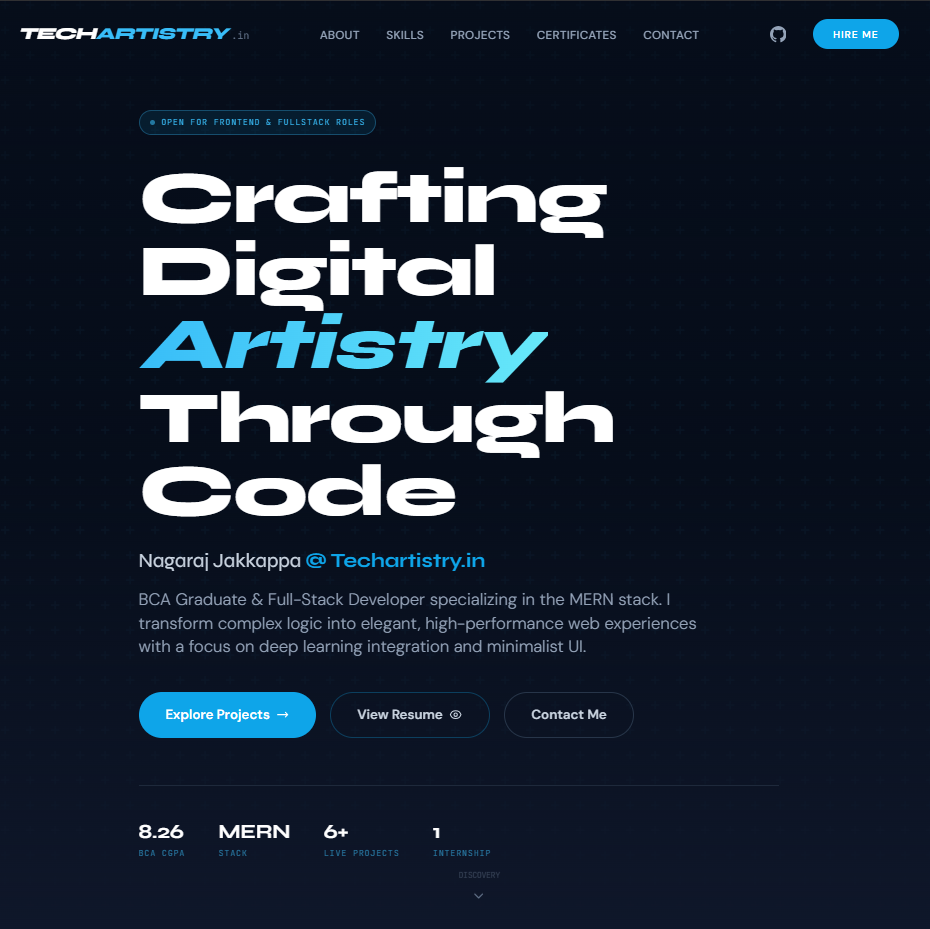
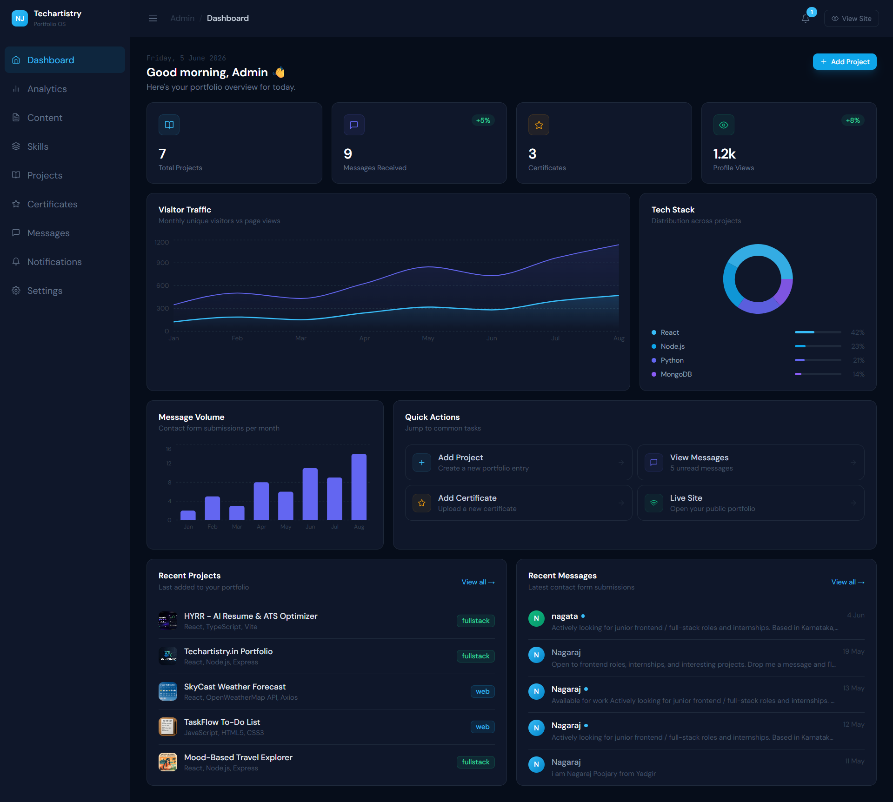

# Techartistry - MERN Portfolio

A full-stack MERN portfolio with public portfolio pages and a secure admin dashboard for managing projects, skills, certificates, messages, notifications, and analytics.

## Live Demo

- **Public Website:** [https://www.techartistry.in/](https://www.techartistry.in/)
- **Admin Panel:** [https://www.techartistry.in/admin/](https://www.techartistry.in/admin/)
- _Note: Admin access is private and not publicly shared._

## Features

**Public:**

- Responsive portfolio homepage
- Projects showcase
- Skills section
- Certificates section
- Contact form
- Resume download
- SEO/meta tags

**Admin:**

- Secure JWT login
- Admin dashboard
- Projects CRUD
- Skills management
- Certificates management
- Message inbox
- Notifications
- Analytics/stats dashboard

**Security:**

- Dedicated MongoDB database user
- JWT protected admin routes
- 4-hour admin token expiry
- Rate limiting
- Security headers
- Input validation using express-validator
- Secrets stored in `.env` and ignored by Git

## Tech Stack

**Frontend:**

- React
- Vite
- Tailwind CSS
- React Router
- Axios
- Recharts

**Backend:**

- Node.js
- Express.js
- MongoDB
- Mongoose
- JWT (jsonwebtoken)
- bcryptjs
- express-validator
- express-rate-limit

**Deployment:**

- Vercel (Frontend)
- Render / VPS (Backend)
- MongoDB Atlas

## Architecture

The application is structured as a monorepo with separate `client` and `server` directories:

- **`client/`**: Contains the React frontend built with Vite. It consumes the REST API and handles routing, state, and UI.
- **`server/`**: Contains the Express.js backend. It connects to MongoDB Atlas, serves RESTful endpoints, and handles authentication.
- **REST API**: Follows standard CRUD operations returning JSON responses.
- **Protected Admin Routes**: Authenticated using a Bearer token (JWT) via custom auth middleware.
- **MongoDB Models**: Defined using Mongoose schemas for structured data validation at the database level (`Admin`, `Project`, `Skill`, `Certificate`, `Message`, `Notification`).

## Folder Structure

```text
mern-portfolio/
├── client/
│   ├── public/
│   ├── src/
│   │   ├── api/
│   │   ├── components/
│   │   ├── context/
│   │   ├── hooks/
│   │   ├── pages/
│   │   └── App.jsx
│   └── package.json
├── server/
│   ├── middleware/
│   ├── models/
│   ├── routes/
│   ├── index.js
│   └── package.json
├── package.json
└── README.md
```

## Environment Variables

Create a `.env` file in the `server` directory. Use the following placeholders:

```env
MONGO_URI=mongodb+srv://<db_username>:<db_password>@cluster.mongodb.net/<db_name>?retryWrites=true&w=majority
JWT_SECRET=your_super_secret_jwt_key
ADMIN_EMAIL=admin@example.com
ADMIN_PASSWORD=your_secure_admin_password
EMAIL_USER=your_smtp_email@gmail.com
EMAIL_PASS=your_smtp_app_password
CLIENT_URL=http://localhost:5173
NODE_ENV=development
PORT=5180
```

_Note: Never commit real secrets or credentials to version control._

## Local Setup

1. **Clone repo**
   ```bash
   git clone https://github.com/Nagaraj-Jakkappa/mern-portfolio.git
   cd mern-portfolio
   ```
2. **Install root dependencies**
   ```bash
   npm install
   ```
3. **Install client and server dependencies** (if not handled by root)
   ```bash
   cd client && npm install
   cd ../server && npm install
   ```
4. **Create `server/.env`** using the placeholders provided above.
5. **Run the development server** (from the root directory)
   ```bash
   npm run dev
   ```
6. **Open in browser**
   - Frontend: `http://localhost:5173`
   - Backend API: `http://localhost:5180`

## API Overview

- `GET /api/auth` - Admin authentication and password rotation
- `GET /api/projects` - Project CRUD operations
- `GET /api/skills` - Skill CRUD operations
- `GET /api/certificates` - Certificate CRUD operations
- `GET /api/messages` - Contact form submissions and inbox management
- `GET /api/notifications` - Admin alerts and notifications
- `GET /api/stats` - Dashboard analytics data

## Security Notes

- **No public reset route**: Admin seeding and destructive actions are removed from the public API.
- **.env ignored**: Environment variables are strictly ignored by `.gitignore`.
- **Admin credentials private**: Authentication is securely hashed using `bcryptjs`.
- **Credential Rotation**: Old exposed credentials have been safely rotated.
- **Least Privilege**: Database users are separated with scoped permissions for this specific application.

## Screenshots


_Homepage View_


_Admin Analytics Dashboard_


_Projects CMS Management_

## What I Learned

- **MERN Architecture**: Designing and integrating a decoupled React frontend with an Express/MongoDB backend.
- **Authentication**: Implementing secure, stateless JWT authentication with token expiration and protected route middleware.
- **REST APIs**: Building scalable and predictable RESTful API endpoints for a Custom Management System (CMS).
- **Admin Dashboards**: Creating a secure administrative interface to manage portfolio content dynamically without touching code.
- **MongoDB Modeling**: Structuring relational and non-relational data efficiently using Mongoose schemas.
- **Security Cleanup**: Auditing code for vulnerabilities, rotating exposed credentials, and removing dangerous public routes.
- **Production Readiness**: Adding input validation (`express-validator`), rate limiting, and security headers for robust deployment.

## Future Improvements

- Migrate the codebase to TypeScript for better type safety.
- Implement a refresh token authentication flow.
- Add comprehensive Unit and Integration tests.
- Optimize Lighthouse scores (accessibility, performance).
- Add more detailed analytics charts and visitor tracking.

## Author

**Nagaraj Jakkappa**

- **Portfolio:** [https://www.techartistry.in/](https://www.techartistry.in/)
- **GitHub:** [https://github.com/Nagaraj-Jakkappa](https://github.com/Nagaraj-Jakkappa)
- **LinkedIn:** [www.linkedin.com/in/nagaraj-jakkappa-661401268](http://www.linkedin.com/in/nagaraj-jakkappa-661401268)
