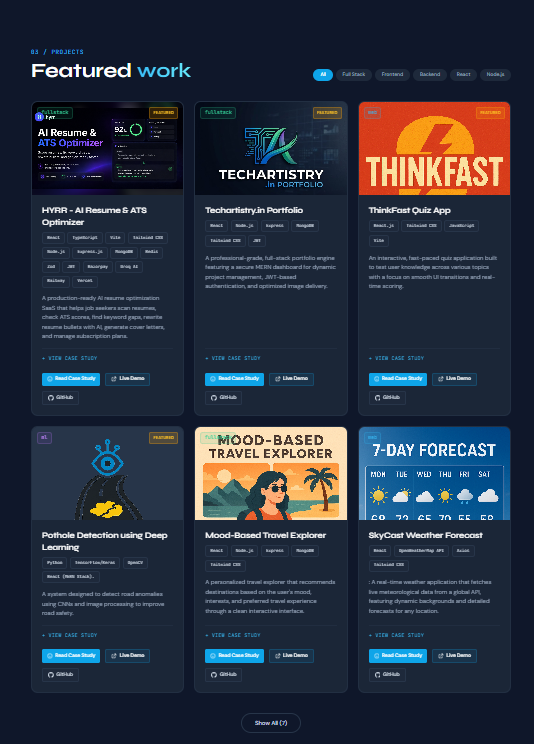
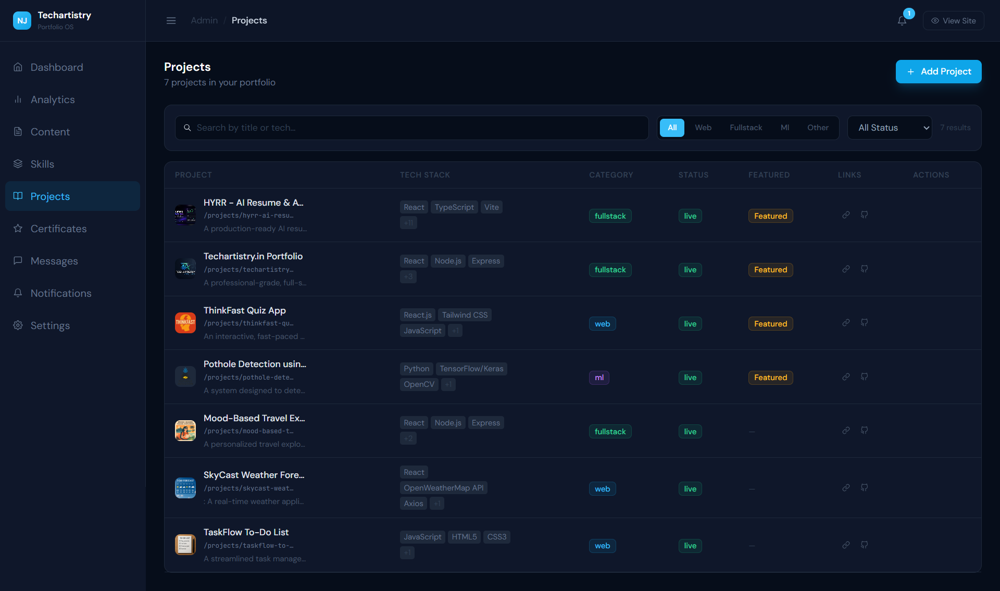

# 🚀 Techartistry - MERN Portfolio CMS

A full-stack professional portfolio application built with MongoDB, Express, React, and Node.js.

**Live website:** [https://www.techartistry.in/](https://www.techartistry.in/)  
**Admin panel:** [https://www.techartistry.in/admin/](https://www.techartistry.in/admin/)  
*(Note: Admin access is strictly private)*

---

## 📸 Screenshots

| Homepage | Projects |
| :---: | :---: |
|  |  |

| Admin Dashboard | Admin Projects |
| :---: | :---: |
|  |  |

---

## ✨ Features

### Public Portfolio
- **Dynamic Hero Section:** Engaging introduction.
- **Currently Building / About:** Professional background.
- **Skills & Certificates:** Dynamic rendering of technical capabilities.
- **Featured Projects:** Case studies, live filters, and featured badges.
- **Contact Form:** Integrated messaging system.
- **Responsive Design:** Fully mobile-optimized UI.

### Admin CMS
- **Dashboard Overview:** Analytics and quick stats.
- **Projects Management:** Add, edit, delete, mark as featured, change status (Live/Draft/Archived).
- **Certificates Management:** Full CRUD operations for certifications.
- **Messages System:** Read, unread, archive, and delete contact inquiries.
- **Notifications:** Real-time system updates and message alerts.
- **Settings:** Admin profile and password rotation.

---

## 🛡️ Security Features
- **JWT Authentication:** Secure token validation with short 4-hour expiry.
- **Password Hashing:** Admin passwords secured using `bcrypt`.
- **Role-Based Access:** Drafts and archived projects are protected from public API access.
- **Backend Validation:** Robust input sanitization using `express-validator`.
- **Clean Configuration:** Secrets separated using `.env` (no hardcoded credentials).
- **No Nuclear Options:** Destructive debug routes are fully disabled.

---

## 💻 Tech Stack
- **Frontend:** React, Vite, Tailwind CSS
- **Backend:** Node.js, Express.js
- **Database:** MongoDB, Mongoose
- **Tooling:** Prettier, ESLint

---

## 📁 Folder Structure

```
mern-portfolio/
├── client/                  # React + Vite + Tailwind frontend
│   ├── src/
│   │   ├── api/             # Axios instance with interceptors
│   │   ├── components/      # UI components (Admin & Public)
│   │   ├── context/         # Auth context provider
│   │   ├── pages/           # Route views
│   │   └── index.css        # Global styles
│   └── .env.example
├── server/                  # Express + MongoDB backend
│   ├── models/              # Mongoose schemas (Project, Message, Certificate, etc.)
│   ├── routes/              # API endpoints
│   ├── middleware/          # JWT and Validation guards
│   └── .env.example
└── docs/                    # Documentation and screenshots
```

---

## ⚡ Local Setup

### 1. Install dependencies
```bash
# Install server and client dependencies
npm run install:all
```

### 2. Configure environment variables
Create `.env` files based on the `.env.example` templates.

**`server/.env`**
```env
PORT=5180
MONGO_URI=mongodb+srv://<username>:<password>@cluster.mongodb.net/<dbname>
JWT_SECRET=your_super_secret_jwt_key
EMAIL_USER=your_email@gmail.com
EMAIL_PASS=your_app_password
```

**`client/.env`**
```env
VITE_API_URL=http://localhost:5180/api
```

### 3. Start development servers
```bash
# Runs both frontend (5173) and backend (5180) concurrently
npm run dev
```

---

## 🔑 API Overview

| Method | Route                         | Auth | Description                   |
| ------ | ----------------------------- | ---- | ----------------------------- |
| POST   | `/api/auth/login`             | ❌   | Admin login → JWT             |
| GET    | `/api/auth/me`                | ✅   | Verify current admin          |
| GET    | `/api/projects`               | ❌   | Get live projects             |
| GET    | `/api/projects?admin=true`    | ✅   | Get all projects (inc. Drafts)|
| POST   | `/api/projects`               | ✅   | Create project                |
| PUT    | `/api/projects/:id`           | ✅   | Update project                |
| DELETE | `/api/projects/:id`           | ✅   | Delete project                |
| GET    | `/api/certificates`           | ❌   | Get certificates              |
| POST   | `/api/messages`               | ❌   | Submit contact form           |
| GET    | `/api/messages`               | ✅   | View all messages             |

---
